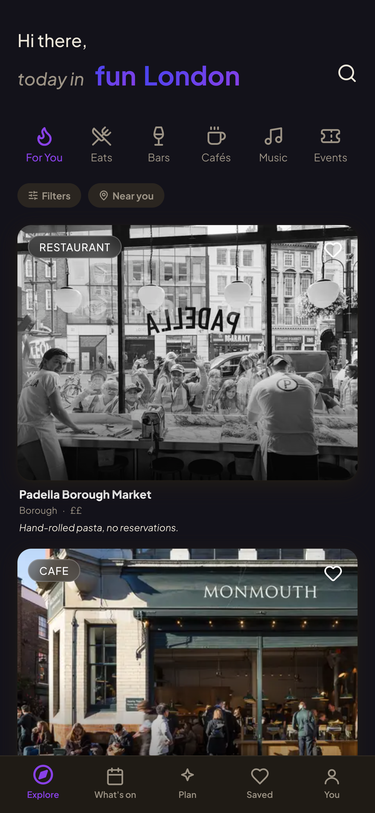

# Fun London

**Plan a whole night out in London, not just one place.**

Most going-out apps hand you a ranked list and leave the hard part to you. Fun London builds
the night: three stops you can walk between, chosen for the mood you are in, at a time you can
actually make. On your own, or with friends deciding together in real time.

Live at **[funldn.com](https://www.funldn.com)** · ~2,100 curated London venues · built solo.

<!-- SCREENSHOT SLOT: drop a phone frame at docs/screenshot.png and uncomment
     
-->

## What it does

- **Explore** a catalogue of London venues, filtered by mood, area, price and time of day.
- **Plan** a three-stop night. Pick a vibe, a budget and an area, and get a walkable route with
  arrival times, drawn on a real street map.
- **Plan Together.** Open a room, share a four-character code, and everyone swipes the same mood
  deck. The plan is built from the group's combined taste, and any stop can be vetoed.
- **What's on**, pulled from Eventbrite and Ticketmaster, deduped and refreshed through the day.

## How it works

Three parts are more interesting than the CRUD, so they get the space.

### 1. A recommender built on venue "fingerprints"

Every venue becomes a 486-dimension vector in two halves:

| Half | Dimensions | What it captures |
|---|---|---|
| Tags | 102 | *What it is.* IDF-weighted over a canonical vocabulary, so `omakase` counts far more than `casual`. |
| Reviews | 384 | *How it feels.* A sentence embedding of the venue's Google reviews. |

Review embeddings come from `all-MiniLM-L6-v2` running locally on CPU, so there is no embedding
API, no vendor and no per-call cost. Each review is embedded separately, because the model
truncates at 256 tokens and concatenating five reviews would silently discard most of them. The
per-review vectors are then mean-pooled into one unit vector.

Because both halves are unit-normalised and separately weighted, the cosine between two venues
is exactly a weighted average of their tag-cosine and their review-cosine. One scalar trades
"what it is" against "how it feels".

Your taste is a vector in the same space: a recency-decayed, signal-weighted sum of the venues
you engaged with, on a 45-day half-life. A single venue's pull is clamped to ±2.0, so twenty
visits to one place cannot bend the whole model.

**Three problems that only showed up against real data:**

*Everything looked similar.* Raw review vectors cluster around a cosine of roughly 0.85, because
every venue's reviews say it is lovely. Cosine was mostly measuring "is this a nice place", so
the same glossy venues leaked into every feed. Fixed by subtracting the catalogue centroid from
every vector before scoring, which makes similarity measure *distinctive* character instead.

*Being active made recommendations worse.* Impressions outnumber deliberate actions by an order
of magnitude, and PostgREST silently caps an unbounded select at 1,000 rows. A single query let
scroll-past events crowd out the saves entirely, so taste degraded the more you used the app.
Fixed with separate fetch budgets per signal family.

*Scroll-past history recommended dental clinics.* Weighting impressions negatively injected the
average-venue direction into the taste vector, and the average venue is not a bar. Now the
penalty is flat per venue, applies only after three impressions, is skipped for anything you
explicitly acted on, and is rescaled so it can never exceed 35% of the deliberate-signal
magnitude. It can refine taste. It cannot dominate it.

Ratings are Bayesian-shrunk toward a catalogue prior, so a 5.0 from ten reviews does not outrank
a 4.7 from five thousand. The final feed is re-ranked with Maximal Marginal Relevance plus a
category-spread penalty, so it is not ten near-identical wine bars.

Personalisation fails open. Missing embeddings, missing signals or a missing service key all
return the default feed order rather than an error.

### 2. Multiplayer with no server state

A Plan Together room has no database table. No rooms, no sessions, no participants, nothing to
clean up. A room is one Supabase Realtime channel keyed by its code: presence carries the member
list, broadcast carries everything else.

That makes determinism a hard requirement, because every device builds the plan independently
and they all have to agree:

- The host's settings resolve to an **absolute** meeting timestamp, not "tonight".
- The mood deck is derived from the host's time of day, so vote indices line up.
- Group taste is applied only once **every** member's map has arrived. Until then the plan stays
  rating-led. Two phones averaging different subsets would otherwise build different nights.
- Broadcast has no replay, so members re-broadcast their state whenever someone joins.

**Taste is blended peer to peer.** Each device calls a server action that takes no user id and
resolves the user from the session, so there is no endpoint that can return another person's
taste vector. Devices share their own map into the room and each one averages the pool locally.
(Your map is visible to the room you joined. It is never obtainable from the server by anyone
else.)

A stop swaps only when strictly more than half the live group vetoes it, so no one person can
override the group. Only the host applies the swap, so devices never race, and the broadcast is
idempotent. When someone leaves, their votes stop counting immediately, both by pruning and by
filtering the tally at count time, so a departure can never accidentally cross the threshold.

The route is drawn with Leaflet on greyscale OpenStreetMap and CARTO tiles, routed by the public
OSRM walking profile. No map API key reaches the browser. If the router is slow, the map still
renders and falls back to a dashed straight-line path after three seconds.

### 3. A signed-out wall that is still CDN-cacheable

Anonymous visitors get a real page, fast, without leaking the catalogue.

Middleware checks for a Supabase auth cookie. If there is none, it never touches Supabase Auth
at all and rewrites `/venue/[slug]` to an ISR twin at `/anon/venue/[slug]`, revalidating every
15 minutes. Requests carrying a cookie are never rewritten, so a cached anonymous page can never
be built from a signed-in render. The URL the visitor sees does not change.

This only works because the root layout is deliberately cookie-free. Reading `cookies()` there
forces every route into dynamic rendering and silently disables ISR everywhere, with no error to
tell you. The signed-in user id comes from the browser session instead.

**The moat is enforced in Postgres, not in application code.** `SELECT` is revoked from the
`anon` role and re-granted column by column:

```sql
revoke select on public.venues from anon;
grant select (id, slug, name, type, vibe, neighbourhood, price, time_of_day,
              rating, review_count, img_url, lat, lng, curation_tier,
              created_at, google_place_id, hidden_at)
  on public.venues to anon;
```

Descriptions, tags, reviews, phone, address, opening hours and booking links are not readable by
an anonymous client at all. What does reach an anonymous page is a server-derived teaser, capped
at 140 characters and three tags, and only for venues a human has marked as curated.

A leak-guard test feeds a fully-populated row through the single anon mapping function and
asserts all 17 detail fields are blanked, including a raw JSON scan for leaked substrings. It
runs on every pull request.

## Where the data comes from

Venues come from the Google Places API. Events come from Eventbrite and Ticketmaster.

**No generative model is anywhere in the facts or publication path**, and the project has no LLM
SDK as a dependency. An earlier version used one to find "trusted press coverage" and it
hallucinated sources onto live pages, so it was removed. Numeric gates plus human approval are
the quality bar now, and Google reviews are stored verbatim, never summarised.

A candidate venue must be operational, rated 4.4+ with 400+ reviews (150 for galleries, markets
and parks), have a website, match a type allowlist, and have fewer than four London locations
under the same brand. Nothing is auto-published: candidates land in a queue and a human approves
each one in an admin-gated review screen.

| Workflow | Schedule | Does |
|---|---|---|
| `maintenance` | daily | Refresh venues, rotate reviews, backfill embeddings, prune expired events |
| `events-ingest` | every 4h ×2 | Pull curated and London-wide events |
| `discover-venues` | weekly | Google Places sweep into the human review queue |
| `backup-db` | weekly | Gzipped snapshot to private R2, 12-week retention |
| `weekly-digest` | Thursdays | Opt-in email |
| `check` | every PR | typecheck, lint, format, copy lint, tests |

Photos are mirrored from Places into Cloudflare R2 and served from `img.funldn.com` as WebP at
two widths. Note that the Places API is metered, not free: the crons above are deliberately
paced to stay inside the monthly allowance.

## Stack

Next.js 15 (App Router) · React 18 · TypeScript strict · Tailwind 3 · Supabase (Postgres, Auth,
Realtime, pgvector) · Vercel · Cloudflare R2 · Upstash Redis · PostHog · Leaflet · vitest ·
pnpm 9, Node 20 local and 22 in CI.

## Running it locally

```bash
nvm use
pnpm install
cp .env.example .env.local   # Supabase URL + anon key are required to boot
pnpm dev
```

`pnpm check` runs typecheck, lint, format check, the copy linter and the test suite. It gates
every PR. Every mutating script has a `:dry` twin, so `pnpm ingest:dry` shows you what
`pnpm ingest` would change.

| Topic | Read |
|---|---|
| Conventions and architecture rules | [CONTRIBUTING.md](./CONTRIBUTING.md) |
| Deploying from scratch | [DEPLOY.md](./DEPLOY.md) |
| Schema, RLS and column grants | [supabase/schema.sql](./supabase/schema.sql) |
| Colour and type tokens | [docs/fun-london-color-system.md](./docs/fun-london-color-system.md) |
| Restoring from a backup | [docs/RESTORE.md](./docs/RESTORE.md) |

## Status

In active development, in production, with real users. Built by
[Maria Paula Aranzales](https://github.com/mparanzales) as part of the UCL Venture Builder
programme. Design, architecture and code are mine; it is not open to contributions, but the
code is here to read.
